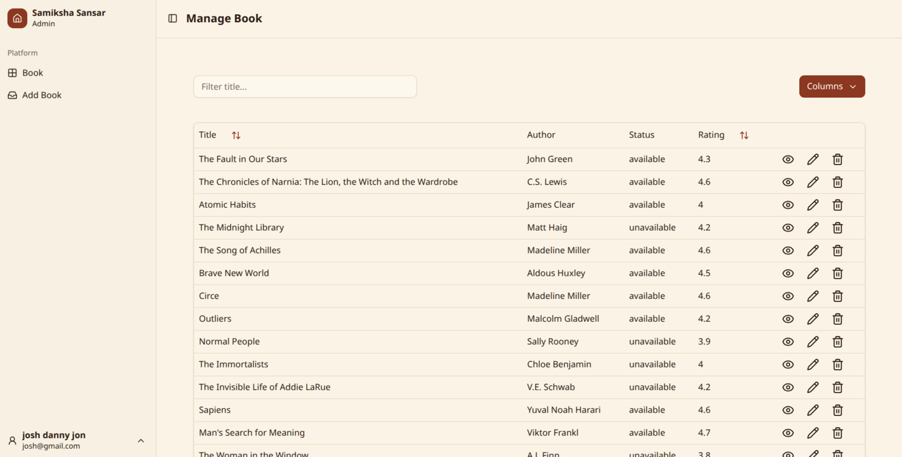

# 📚 Samiksha Sansar

A full-stack book community platform where users can discover books, interact with other readers, discuss books through comments and replies, and borrow or reserve books. Admins can manage the book collection, including adding, editing, and deleting books.

## 🌐 Live Demo

🔗 **[Samiksha Sansar](https://samiksha-sansar-7fdp.vercel.app)**


##  Main Features

* 🔐 **User Authentication & Authorization** — Secure JWT-based authentication with HTTP-only cookie sessions and protected routes.
* 📚 **Book Discovery** — Browse, search, filter, and sort books with detailed book information.
* 🔄 **Borrowing System** — Borrow and return books while tracking current borrowing status.
* 📌 **Book Reservation** — Reserve unavailable books and automatically manage reservation queues.
* ⚡ **Real-Time Notifications** — Receive instant notifications using Socket.IO when reserved books become available.
* ❤️ **Favorites & Saved Books** — Save books and manage personalized favourite collections.
* 📖 **Reading Status Tracking** — Track books based on reading progress and status.
* ⭐ **Reviews & Ratings** — Add, manage, and view user reviews and ratings for books.
* 🖼️ **Image Upload & Management** — Upload and manage book/user images using Multer and Cloudinary.
* 📧 **Email Notifications** — Send automated emails using Nodemailer for important user and system events.
* 📱 **Responsive UI & Production Deployment** — Responsive interface built with Tailwind CSS and shadcn/ui, deployed with Vercel, Render, and MongoDB Atlas.


##  Tech Stack

| Category            | Technologies                                                                                                                |
| ------------------- | --------------------------------------------------------------------------------------------------------------------------- |
| **Frontend**        | Next.js, React.js, TypeScript, Tailwind CSS, shadcn/ui, Redux, Axios, Formik, Yup, Socket.IO Client                         |
| **Backend**         | Node.js, Express.js, RESTful APIs, JWT Authentication, Cookie-based Authentication, Mongoose, Nodemailer, Socket.IO, Multer |
| **Database**        | MongoDB, MongoDB Atlas, Mongoose ODM                                                                                        |
| **Storage & Media** | Cloudinary                                                                                                                  |
| **Deployment**      | Vercel (Frontend), Render (Backend), MongoDB Atlas (Database), Cloudinary (Image Storage)                                   |


## Installation


**Clone the repository:**

```bash
git clone https://github.com/sophiathapa/Samiksha-Sansar.git

```

**Install dependencies (Lucide React):**

```bash
npm install 
# or
yarn add 
```

**Running the Application**

```bash
npm run dev
# or
yarn dev
```


## Screenshots

#### User page


#### Admin page


